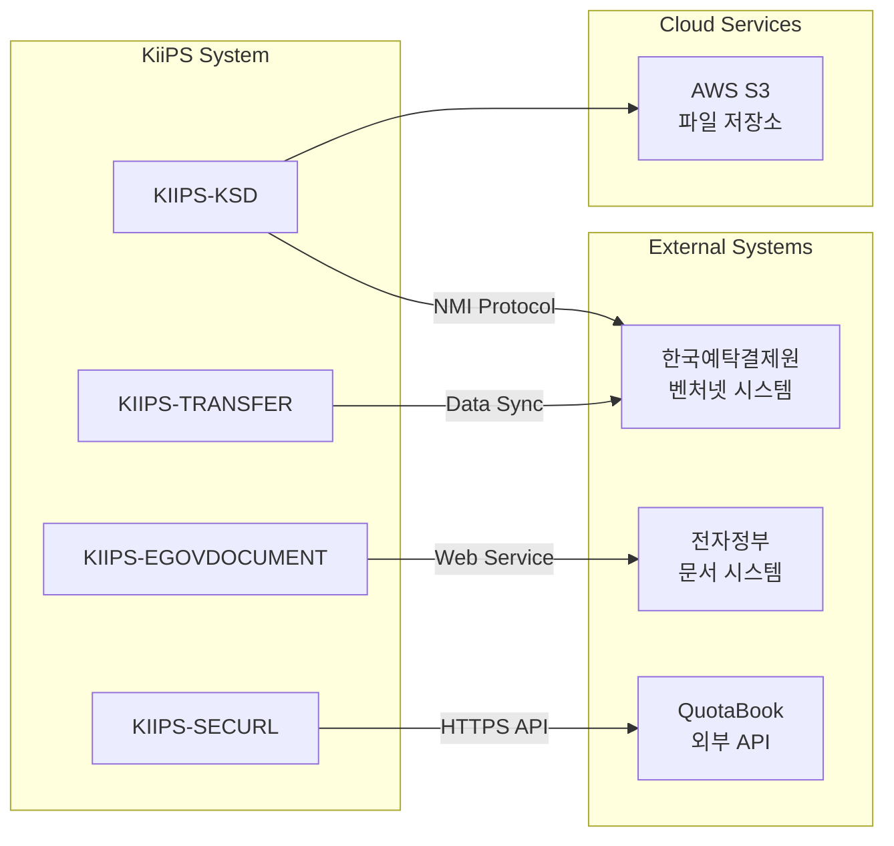
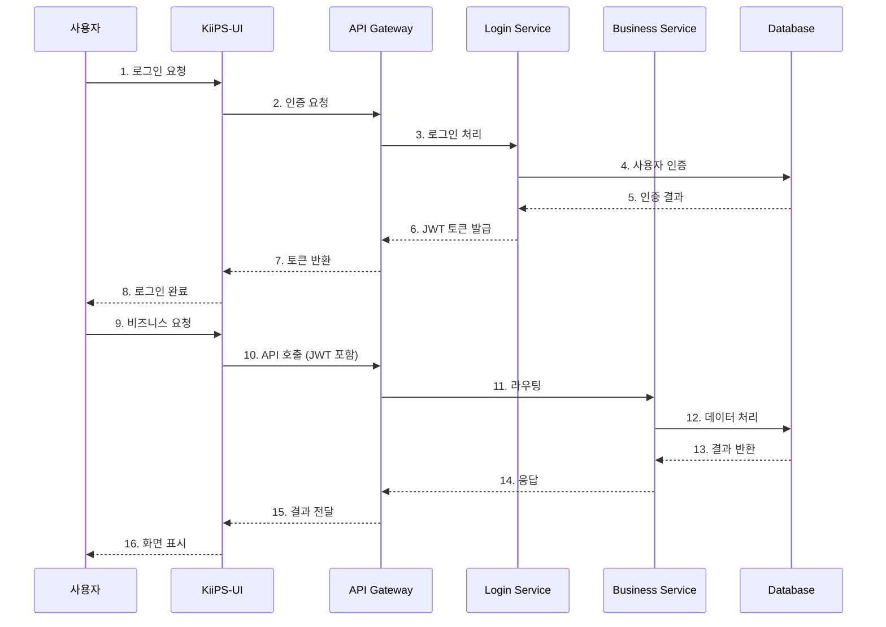

# KiiPS 상세 애플리케이션 구성도

## 1. 전체 시스템 아키텍처 개요

```mermaid
graph TB
    %% 외부 사용자 및 시스템
    User[사용자 - 웹 브라우저]
    External[외부 시스템<br/>- KSD 한국예탁결제원<br/>- 전자정부 시스템]
    
    %% 네트워크 계층
    subgraph "Load Balancer & DNS"
        LB[Load Balancer<br/>shinhanvc.kiips.co.kr]
    end
    
    %% API Gateway 계층
    subgraph "API Gateway Layer"
        APIGW[KIIPS-APIGateway<br/>Port: 8088<br/>Spring Cloud Gateway]
    end
    
    %% Service Discovery 계층
    subgraph "Service Discovery"
        EUREKA[KIIPS-Eureka<br/>Port: 8761<br/>Netflix Eureka Server]
    end
    
    %% Frontend 계층
    subgraph "Presentation Layer"
        UI[KiiPS-UI<br/>Port: 8100<br/>JSP + jQuery + Bootstrap]
    end
    
    %% 인증 서비스
    subgraph "Authentication Service"
        LOGIN[KiiPS-Login<br/>Port: 8801<br/>JWT Authentication]
    end
    
    %% 비즈니스 서비스 계층
    subgraph "Business Services Layer"
        AC[KiiPS-AC<br/>Port: 8901<br/>회계 시스템]
        IL[KiiPS-IL<br/>Port: 8401<br/>투자한도 관리]
        FD[KiiPS-FD<br/>Port: 8601<br/>펀드 관리]
        PG[KiiPS-PG<br/>Port: 8501<br/>결제 게이트웨이]
        SY[KiiPS-SY<br/>Port: 8301<br/>시스템 관리]
        EL[KiiPS-EL<br/>Port: 8201<br/>이벤트 로그]
        RT[KiiPS-RT<br/>Port: 8001<br/>실시간 처리]
        LP[KiiPS-LP<br/>Port: 8101<br/>대출 처리]
        COMMON[KiiPS-COMMON<br/>Port: 8701<br/>공통 서비스]
    end
    
    %% 외부 연동 서비스
    subgraph "External Integration Services"
        KSD[KIIPS-KSD<br/>한국예탁결제원 연동<br/>NMI 프로토콜]
        TRANSFER[KIIPS-TRANSFER<br/>데이터 전송 서비스]
        SECURL[KIIPS-SECURL<br/>보안 URL 처리]
        EGOVDOC[KIIPS-EGOVDOCUMENT<br/>전자정부 문서 연동]
    end
    
    %% 지원 서비스
    subgraph "Support Services"
        BATCH[KIIPS-BATCH<br/>배치 작업 처리]
        MOBILE[KIIPS-MOBILE<br/>모바일 API]
        MSGSENDER[KIIPS-MSGSender<br/>메시지 발송<br/>SMS/메일/Push]
        MES[KiiPS-MES<br/>메시징 시스템]
        HELP[KIIPS-HELP<br/>Port: 9400<br/>헬프데스크]
        LAB[KIIPS-LAB<br/>Port: 8888<br/>실험/테스트 환경]
        INFRAADMIN[KIIPS-Infra-Admin<br/>Port: 8875<br/>인프라 관리]
    end
    
    %% 데이터베이스 계층
    subgraph "Database Layer"
        TIBERO[(Tibero DB<br/>Primary Database)]
        MYSQL[(MySQL/MariaDB<br/>Secondary Database)]
        MSSQL[(MSSQL<br/>Legacy Database)]
    end
    
    %% 외부 클라우드 서비스
    subgraph "Cloud Services"
        AWS[AWS S3<br/>파일 저장소]
    end
    
    %% 연결 관계
    User --> LB
    LB --> APIGW
    APIGW --> EUREKA
    APIGW --> UI
    APIGW --> LOGIN
    
    UI --> AC
    UI --> IL
    UI --> FD
    UI --> PG
    UI --> SY
    UI --> EL
    UI --> RT
    UI --> LP
    UI --> COMMON
    
    AC --> EUREKA
    IL --> EUREKA
    FD --> EUREKA
    PG --> EUREKA
    SY --> EUREKA
    EL --> EUREKA
    RT --> EUREKA
    LP --> EUREKA
    COMMON --> EUREKA
    LOGIN --> EUREKA
    
    KSD --> External
    EGOVDOC --> External
    KSD --> AWS
    
    AC --> TIBERO
    IL --> TIBERO
    FD --> TIBERO
    PG --> TIBERO
    SY --> TIBERO
    EL --> TIBERO
    RT --> TIBERO
    LP --> TIBERO
    COMMON --> TIBERO
    LOGIN --> TIBERO
    
    TRANSFER --> MYSQL
    TRANSFER --> MSSQL
    
    BATCH --> MSGSENDER
    MOBILE --> APIGW
```



## 2. 포트 할당 및 서비스 매핑

### Core Infrastructure Services
| 서비스명              | 포트   | 역할        | Spring Application Name |
| ----------------- | ---- | --------- | ----------------------- |
| KIIPS-Eureka      | 8761 | 서비스 디스커버리 | KIIPSDiscovery          |
| KIIPS-APIGateway  | 8088 | API 게이트웨이 | KIIPSGateway            |
| KIIPS-Infra-Admin | 8875 | 인프라 관리    | -                       |

### Frontend Service
| 서비스명 | 포트 | 역할 | Spring Application Name |
|---------|------|------|-------------------------|
| KiiPS-UI | 8100 | 웹 사용자 인터페이스 | ui |

### Authentication Service
| 서비스명 | 포트 | 역할 | Spring Application Name |
|---------|------|------|-------------------------|
| KiiPS-Login | 8801 | 인증/로그인 서비스 | KIIPSLOGIN |

### Business Services
| 서비스명 | 포트 | 역할 | Spring Application Name | API Path |
|---------|------|------|-------------------------|----------|
| KiiPS-AC | 8901 | 회계 시스템 | kiipsac | /ACAPI/** |
| KiiPS-IL | 8401 | 투자한도 관리 | kiipsil | /ILAPI/** |
| KiiPS-FD | 8601 | 펀드 관리 | kiipsfd | /FDAPI/** |
| KiiPS-PG | 8501 | 결제 게이트웨이 | kiipspg | /PGAPI/** |
| KiiPS-SY | 8301 | 시스템 관리 | kiipssy | /SYAPI/** |
| KiiPS-EL | 8201 | 이벤트 로그 관리 | kiipsel | /ELAPI/** |
| KiiPS-RT | 8001 | 실시간 처리 | kiipsrt | /RTAPI/** |
| KiiPS-LP | 8101 | 대출 처리 | kiipslp | /LPAPI/** |
| KiiPS-COMMON | 8701 | 공통 서비스 | kiipscommon | /COMMONAPI/** |

### Support Services
| 서비스명 | 포트 | 역할 |
|---------|------|------|
| KIIPS-HELP | 9400 | 헬프데스크 |
| KIIPS-LAB | 8888 | 실험/테스트 환경 |
| KIIPS-MSGSender | 9432 | 메시지 발송 서비스 |

## 3. 환경별 설정 구성

### 환경 분류
1. **Local Development** (`app-local.properties`)
2. **Staging** (`app-stg.properties`)
3. **Production KiiPS** (`app-kiips.properties`)
4. **Production ShinhanVC** (`app-shinhanvc.properties`)
5. **Disaster Recovery** (`app-*-dr.properties`)

### 데이터베이스 환경별 구성
- **Tibero**: Primary database for production
- **MySQL/MariaDB**: Alternative database support
- **MSSQL**: Legacy system integration

## 4. API Gateway 라우팅 규칙

```yaml
# API Gateway Routes Configuration
Login Service: /login/** → lb://KIIPSLOGIN
Column Search: /admin/util/column/** → lb://columnsearch
Common API: /COMMONAPI/** → lb://kiipscommon
Fund API: /FDAPI/** → lb://kiipsfd
Payment API: /PGAPI/** → lb://kiipspg
Investment Limit API: /ILAPI/** → lb://kiipsil
System API: /SYAPI/** → lb://kiipssy
Accounting API: /ACAPI/** → lb://kiipsac
Event Log API: /ELAPI/** → lb://kiipsel
Loan Processing API: /LPAPI/** → lb://kiipslp
Real-time API: /RTAPI/** → lb://kiipsrt
```

## 5. 외부 시스템 연동 아키텍처


## 6. 프론트엔드 아키텍처

### JSP 기반 웹 애플리케이션 구조
```
KiiPS-UI Frontend Architecture:
├── JSP Views (/WEB-INF/jsp/kiips/)
│   ├── AC/ (회계 화면)
│   ├── FD/ (펀드 화면)
│   ├── IL/ (투자한도 화면)
│   ├── PG/ (결제 화면)
│   ├── SY/ (시스템 관리 화면)
│   └── include/ (공통 포함 파일)
├── Static Resources (/static/)
│   ├── js/ (jQuery, 커스텀 스크립트)
│   ├── css/ (Bootstrap, 커스텀 스타일)
│   └── vendor/ (서드파티 라이브러리)
└── 주요 기술 스택:
    ├── jQuery & jQuery UI
    ├── Bootstrap Framework
    ├── RealGrid (데이터 그리드)
    ├── AmCharts (차트 라이브러리)
    └── CodeMirror (코드 에디터)
```

### 보안 아키텍처
- **JWT 인증**: 토큰 기반 인증 시스템
- **XSS 보호**: Lucy XSS 필터 적용
- **CORS 정책**: API Gateway에서 CORS 관리
- **세션 관리**: 커스텀 세션 관리 시스템

## 7. 로깅 및 모니터링 시스템

### 로그 파일 분류
```
각 서비스별 로그 구조:
├── logs/
│   ├── api_time.{date}.log (API 응답시간)
│   ├── err_log.{date}.log (에러 로그)
│   ├── sql.{date}.log (SQL 실행 로그)
│   ├── auth.{date}.log (인증 로그)
│   ├── session.{date}.log (세션 로그)
│   └── {domain}.{date}.log (도메인별 비즈니스 로그)
```

### 모니터링 엔드포인트
- **Eureka Dashboard**: 서비스 상태 모니터링
- **Spring Boot Actuator**: 헬스체크, 메트릭
- **Spring Boot Admin**: 통합 모니터링 (Port 8875)

## 8. 빌드 및 배포 아키텍처

### Maven 멀티모듈 구조
```
KiiPS-HUB (Parent POM)
├── KiiPS-UTILS (공통 유틸리티)
├── KiiPS-COMMON (공통 서비스)
├── KiiPS-UI (프론트엔드)
├── KiiPS-Login (인증)
├── Business Modules (AC, IL, FD, PG, SY, EL, RT, LP)
├── Integration Modules (KSD, TRANSFER, SECURL, EGOVDOCUMENT)
├── Support Modules (BATCH, MOBILE, MSGSender, MES, HELP, LAB)
└── Infrastructure Modules (Eureka, APIGateway, Infra-Admin)
```

### 배포 스크립트 구조
각 모듈별 표준 스크립트:
- `start.sh`: 서비스 시작
- `stop.sh`: 서비스 종료
- `build_*.sh`: 빌드 및 배포
- `log_*.sh`: 로그 모니터링

## 9. 보안 및 데이터 플로우



이 구성도는 KiiPS 시스템의 실제 구현을 기반으로 한 상세한 아키텍처를 보여주며, 각 컴포넌트 간의 통신 방식, 포트 할당, 그리고 실제 운영 환경에서의 서비스 구성을 정확히 반영합니다.