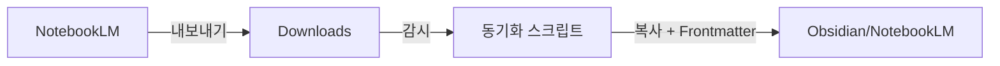

# NotebookLM → Obsidian 자동 동기화 가이드

NotebookLM에서 작성한 노트를 Obsidian과 자동으로 동기화하는 방법입니다.

## 🚀 빠른 시작

### 1단계: 설치

터미널을 열고 다음 명령어를 실행하세요:

```bash
cd ".scripts/notebooklm_sync"
./install.sh
```

### 2단계: 동기화 시작

```bash
./start.sh
```

또는:

```bash
python3 sync.py
```

### 3단계: NotebookLM에서 파일 내보내기

1. NotebookLM에서 노트 작성
2. 마크다운(.md) 형식으로 내보내기
3. Downloads 폴더에 저장
4. 자동으로 `[[NotebookLM]]` 폴더에 나타남! ✨

## 📋 작동 방식



## ⚙️ 설정 변경

`.scripts/notebooklm_sync/config.yaml` 파일을 수정하세요:

### 감시 폴더 변경

```yaml
watch_folder: "~/Documents/NotebookLM-Export"  # 원하는 폴더로 변경
```

### 저장 위치 변경

```yaml
target_folder: "Imported/NotebookLM"  # Obsidian 내 경로
```

### 자동 태그 변경

```yaml
auto_tags:
  - "notebooklm"
  - "imported"
  - "research"  # 원하는 태그 추가
```

## 🎨 Frontmatter 예시

스크립트가 자동으로 추가하는 메타데이터:

```yaml
---
created: 2025-12-17 10:30:00
source: NotebookLM
original_filename: my_research_notes.md
tags: [notebooklm, imported]
---

# 여기부터 원본 내용
...
```

## 💡 사용 팁

### 1. 백그라운드 실행

터미널을 닫아도 계속 실행:

```bash
cd ".scripts/notebooklm_sync"
nohup python3 sync.py &
```

프로세스 종료:

```bash
pkill -f sync.py
```

### 2. 로그 확인

문제가 있을 때:

```bash
tail -f .scripts/notebooklm_sync/sync.log
```

### 3. 특정 파일만 동기화

config.yaml에서:

```yaml
file_patterns:
  - "Research_*.md"  # Research로 시작하는 파일만
```

## 🔧 문제 해결

### 파일이 동기화되지 않아요

1. ✅ 파일이 `.md` 확장자인지 확인
2. ✅ 스크립트가 실행 중인지 확인
3. ✅ 로그 파일 확인: `cat .scripts/notebooklm_sync/sync.log`

### 스크립트가 시작되지 않아요

```bash
# Python 확인
python3 --version

# 패키지 재설치
cd ".scripts/notebooklm_sync"
pip3 install -r requirements.txt --upgrade
```

## 📱 자동 시작 설정 (선택사항)

macOS에서 부팅 시 자동 실행하려면:

1. LaunchAgent 파일 생성:

```bash
nano ~/Library/LaunchAgents/com.notebooklm.sync.plist
```

2. 내용 붙여넣기 (README.md 참고)

3. 활성화:

```bash
launchctl load ~/Library/LaunchAgents/com.notebooklm.sync.plist
```

## 🔗 관련 링크

- [[.scripts/notebooklm_sync/README|상세 README]]
- [[NotebookLM]] - 동기화된 노트들

## ⏭️ 다음 단계

- [ ] 첫 번째 노트 동기화 테스트
- [ ] 태그 시스템 정리
- [ ] 워크플로우 최적화

---

💬 **질문이나 문제가 있나요?**
`.scripts/notebooklm_sync/README.md` 파일을 참고하거나 스크립트를 직접 수정해서 사용하세요!
