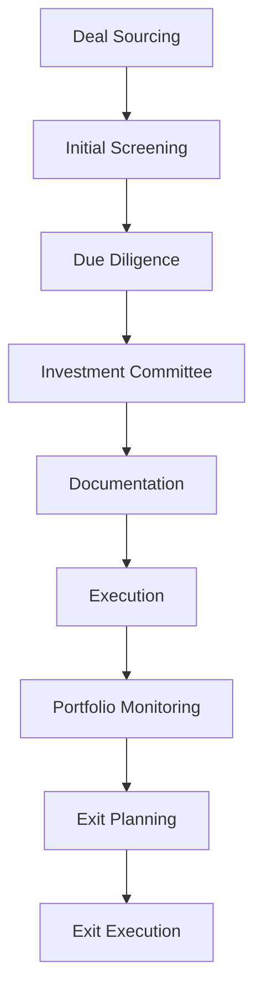

# KiiPS Core Business Services 모듈 분석

## 1. 모듈 개요

KiiPS의 핵심 비즈니스 서비스는 투자정보처리 시스템의 주요 업무 기능을 담당하는 11개의 마이크로서비스로 구성됩니다. 각 모듈은 특정 비즈니스 도메인을 담당하며, RESTful API를 통해 상호 통신합니다.

### 1.1 공통 기술 스택
- **Framework**: Spring Boot 2.4.2 + Java 8
- **Database**: Oracle 11g (Primary), MariaDB (Secondary)
- **Security**: JWT 토큰 기반 인증
- **Communication**: REST API + JSON
- **Build Tool**: Maven
- **Architecture**: Domain-Driven Microservices

## 2. Frontend 서비스

### 2.1 KiiPS-UI (사용자 인터페이스)

#### 기본 구성
```yaml
포트: 8100
서비스명: ui
역할: 웹 프론트엔드 및 정적 리소스 서빙
```

#### 기술 스택
```javascript
// Frontend Technologies
JSP + JSTL              // 서버사이드 렌더링
jQuery 3.x + jQuery UI  // JavaScript 라이브러리
Bootstrap 4.x           // CSS 프레임워크
RealGrid               // 데이터 그리드
AmCharts               // 차트 라이브러리
CodeMirror             // 코드 에디터
Lucy XSS Filter        // XSS 보안 필터
```

#### 주요 기능
1. **JSP 페이지 서빙**: 비즈니스 도메인별 화면 제공
2. **정적 리소스 관리**: CSS, JS, 이미지 파일 서빙
3. **파일 업로드/다운로드**: 문서 관리 기능
4. **WebSocket 지원**: 실시간 통신
5. **반응형 웹 인터페이스**: 다양한 디바이스 지원

#### 디렉토리 구조
```
src/main/webapp/WEB-INF/jsp/kiips/
├── AC/     # 회계 화면
├── FD/     # 펀드 화면  
├── IL/     # 투자한도 화면
├── PG/     # 포트폴리오 화면
├── SY/     # 시스템 관리 화면
├── EL/     # 전자결재 화면
├── RT/     # 리포팅 화면
├── LP/     # LP 관리 화면
└── include/ # 공통 포함 파일
```

#### 컨트롤러 분석
```java
// 주요 UI 컨트롤러들
@Controller
public class ACUIController {    // 회계 화면
@Controller 
public class ILUIController {    // 투자한도 화면
@Controller
public class FDUIController {    // 펀드 화면
@Controller
public class PGUIController {    // 포트폴리오 화면
@Controller
public class SYUIController {    // 시스템 관리 화면
```

## 3. 인증 서비스

### 3.1 KiiPS-Login (인증 및 세션 관리)

#### 기본 구성
```yaml
포트: 8801
서비스명: KIIPSLOGIN
역할: 사용자 인증 및 세션 관리
```

#### 주요 기능
1. **JWT 기반 인증**: 무상태 토큰 인증
2. **SSE 알림**: Server-Sent Events를 통한 실시간 알림
3. **세션 관리**: 사용자 세션 생명주기 관리
4. **백업 기능**: 시스템 백업 관리

#### 보안 설정
```java
// JWT 토큰 기반 인증
@Configuration
@EnableWebSecurity
public class SecurityConfig {
    // JWT 필터 체인 구성
    // 토큰 검증 및 인가 처리
}
```

#### 데이터베이스 설정
```properties
# Oracle 연결 설정
spring.datasource.driver-class-name=oracle.jdbc.OracleDriver
spring.datasource.hikari.connection-timeout=60000
spring.datasource.hikari.maximum-pool-size=10
```

## 4. 핵심 비즈니스 서비스

### 4.1 KiiPS-AC (회계 시스템)

#### 기본 구성
```yaml
포트: 8901
서비스명: kiipsac
API Path: /ACAPI/**
역할: 투자 회계 및 재무 관리
```

#### 비즈니스 기능
```java
// 80+ API 컨트롤러 (AC0101-AC1106)
AC0101: 계정과목 관리
AC0201-AC0203: 분개장 및 거래 처리
AC0401-AC0501: 재무 보고서 생성
AC0601-AC0801: 계정 조정 및 마감
AC1001-AC1106: 예산 및 재무 분석
```

#### 주요 특징
- **계정과목 체계**: 투자업계 특화 계정 구조
- **거래 처리**: 실시간 분개 처리
- **재무 보고**: 법정 재무제표 자동 생성
- **예산 관리**: 연간/월간 예산 수립 및 통제

### 4.2 KiiPS-IL (투자 라이프사이클 관리)

#### 기본 구성
```yaml
포트: 8401
서비스명: kiipsil
API Path: /ILAPI/**
역할: 투자 프로젝트 전 생명주기 관리
```

#### 비즈니스 기능
```java
// 130+ API 컨트롤러 (IL0102-RM0409) - 가장 복잡한 모듈
IL0102-IL0199: 투자 프로젝트 관리
IL0201-IL0499: 실사 및 심사 프로세스
IL0501-IL0699: 펀드 운용 관리
IL0701-IL0999: 성과 모니터링
IL1801-IL1899: 규제 보고
RM0401-RM0409: 리스크 관리
```

#### 핵심 기능
1. **투자 프로젝트 관리**: Deal Sourcing부터 Exit까지
2. **실사 프로세스**: 법무, 재무, 기술 실사 관리
3. **투자 심의**: 투자위원회 운영
4. **포트폴리오 모니터링**: 투자 후 관리
5. **Exit 관리**: IPO, M&A 프로세스

### 4.3 KiiPS-FD (펀드 관리)

#### 기본 구성
```yaml
포트: 8601
서비스명: kiipsfd
API Path: /FDAPI/**
역할: 펀드 설정 및 운용 관리
```

#### 비즈니스 기능
```java
// 20+ API 컨트롤러 (FD0101-FD0501)
FD0101-FD0199: 펀드 설정 및 구조 설계
FD0201-FD0299: 펀드 성과 추적
FD0301-FD0501: 펀드 보고 및 정산
```

#### 주요 특징
- **펀드 구조 설계**: GP, LP 구조 관리
- **성과 측정**: IRR, MOIC 등 성과 지표
- **분배 관리**: Carried Interest, Management Fee

### 4.4 KiiPS-PG (포트폴리오 관리)

#### 기본 구성
```yaml
포트: 8501
서비스명: kiipspg
API Path: /PGAPI/**
역할: 포트폴리오 구성 및 분석
```

#### 기술적 특징
```java
// WebFlux 기반 반응형 프로그래밍
@Configuration
@EnableWebFlux
public class WebFluxConfig {
    // 비동기 포트폴리오 분석
}
```

#### 비즈니스 기능
```java
// 100+ API 컨트롤러 (PG0103-PG1101)
PG0103-PG0299: 포트폴리오 구성
PG0301-PG0399: 투자 분석
PG0401-PG0599: 성과 측정
PG0601-PG0699: 리스크 분석
PG0901-PG1101: 대시보드 및 리포팅
```

### 4.5 KiiPS-SY (시스템 관리)

#### 기본 구성
```yaml
포트: 8301
서비스명: kiipssy
API Path: /SYAPI/**
역할: 시스템 전반 관리 및 설정
```

#### 비즈니스 기능
```java
// 70+ API 컨트롤러 (MI01xx-SY07xx)
MI0101-MI0399: 사용자 및 권한 관리
MI1301-MI1699: 조직 구조 관리
SY0201-SY0299: 시스템 설정
SY0301-SY0399: 메뉴 및 권한 설정
SY0501-SY0799: 코드 관리
```

### 4.6 KiiPS-EL (전자결재)

#### 기본 구성
```yaml
포트: 8201
서비스명: kiipsel
API Path: /ELAPI/**
역할: 전자결재 및 워크플로우
```

#### 비즈니스 기능
```java
// 10+ API 컨트롤러 (EL0101-EL0204)
EL0101-EL0199: 결재 라인 관리
EL0201-EL0204: 전자서명 및 승인
```

#### 특징
- **Eureka 서비스 디스커버리 활성화**
- **워크플로우 엔진**: 복잡한 승인 프로세스 지원

### 4.7 KiiPS-RT (리포팅 시스템)

#### 기본 구성
```yaml
포트: 8001
서비스명: kiipsrt
API Path: /RTAPI/**
역할: 보고서 생성 및 템플릿 관리
```

#### 기술적 특징
```java
// 비동기 리포트 생성
@EnableAsync
@Configuration
public class AsyncConfig {
    // 대용량 리포트 비동기 처리
}
```

#### 비즈니스 기능
```java
// 40+ API 컨트롤러 (RT0102-RT0409)
RT0102-RT0199: 리포트 템플릿 관리
RT0201-RT0399: 리포트 생성 엔진
RT0401-RT0409: 스케줄링 및 배포
```

### 4.8 KiiPS-LP (LP 관계 관리)

#### 기본 구성
```yaml
포트: 8101
서비스명: kiipslp
API Path: /LPAPI/**
역할: Limited Partner 관계 및 외부 연동
```

#### 특별한 기술적 구성
```java
// 다중 데이터베이스 지원
@Configuration
public class DatabaseConfig {
    @Primary
    DataSource oracleDataSource();    // Oracle - 주 데이터베이스
    
    @Qualifier("mariadb")
    DataSource mariaDataSource();     // MariaDB - LP 전용
    
    @Qualifier("mssql") 
    DataSource mssqlDataSource();     // MSSQL - 레거시 연동
}
```

#### 외부 연동 시스템
```java
// 주요 외부 시스템 연동
KDB (한국개발은행)
KVIC (한국벤처투자)
NPS (국민연금공단)
KODIT (신용보증기금)
SBA (중소벤처기업진흥공단)
```

#### 비즈니스 기능
- **LP 데이터 관리**: 출자자 정보 및 관계 관리
- **외부 보고**: 정부기관 보고서 자동 생성
- **SFTP 데이터 전송**: 정기 보고 자동화
- **AWS S3 연동**: 대용량 파일 처리

### 4.9 KiiPS-COMMON (공통 서비스)

#### 기본 구성
```yaml
포트: 8701
서비스명: kiipscommon
API Path: /COMMONAPI/**
역할: 공통 유틸리티 및 외부 연동
```

#### 클라우드 서비스 연동
```java
// AWS 서비스 연동
@Configuration
public class AwsConfig {
    @Bean AmazonS3 s3Client();        // S3 파일 저장소
    @Bean AmazonSES sesClient();      // SES 이메일 서비스
}
```

#### 주요 기능
1. **파일 관리**: 업로드/다운로드, S3 연동
2. **커뮤니케이션**: 이메일, SMS, Push 발송
3. **외부 API 연동**: 은행, 세무, 문서 서비스
4. **PDF 생성**: 동적 문서 생성
5. **국세청 연동**: HOMETAX API 연동

## 5. 데이터베이스 아키텍처

### 5.1 주 데이터베이스 (Oracle 11g)
```properties
# 공통 Oracle 설정
spring.datasource.driver-class-name=oracle.jdbc.OracleDriver
spring.datasource.url=jdbc:oracle:thin:@IP:PORT:SID
spring.datasource.hikari.maximum-pool-size=10
spring.datasource.hikari.connection-timeout=60000

# 스키마 구조
KIIPS: 운영 스키마
LOGOS_DEV_LIB: 개발 스키마
```

### 5.2 보조 데이터베이스
```yaml
MariaDB: LP 모듈 전용 (고성능 읽기)
MSSQL: 레거시 시스템 연동
```

## 6. 보안 아키텍처

### 6.1 인증 체계
```java
// JWT 토큰 기반 인증
@Component
public class JwtTokenProvider {
    public String generateToken(Authentication auth);
    public boolean validateToken(String token);
    public Authentication getAuthentication(String token);
}
```

### 6.2 보안 필터
```java
// XSS 보호 (UI 모듈)
@Configuration
public class SecurityConfig {
    @Bean
    public FilterRegistrationBean<XssEscapeServletFilter> xssFilterBean() {
        // Lucy XSS Filter 적용
    }
}
```

## 7. API 설계 패턴

### 7.1 RESTful API 표준
```java
// 공통 API 패턴
@RestController
@RequestMapping("/api/v1/{domain}")
public class StandardController {
    
    @GetMapping("/list")           // 목록 조회
    @GetMapping("/{id}")          // 단건 조회  
    @PostMapping                  // 생성
    @PutMapping("/{id}")          // 수정
    @DeleteMapping("/{id}")       // 삭제
}
```

### 7.2 응답 표준화
```java
// 공통 응답 포맷
public class ApiResponse<T> {
    private String status;     // SUCCESS/ERROR
    private String message;    // 응답 메시지
    private T data;           // 응답 데이터
    private String timestamp; // 응답 시간
}
```

## 8. 서비스 간 통신

### 8.1 동기 통신
```java
// RestTemplate 기반 HTTP 통신
@Service
public class ExternalApiService {
    @Autowired
    private RestTemplate restTemplate;
    
    public ResponseEntity<String> callExternalService(String endpoint) {
        return restTemplate.getForEntity(endpoint, String.class);
    }
}
```

### 8.2 비동기 통신
```java
// WebFlux 기반 반응형 통신 (PG 모듈)
@Service
public class ReactiveService {
    @Autowired
    private WebClient webClient;
    
    public Mono<String> callAsync(String endpoint) {
        return webClient.get().uri(endpoint).retrieve().bodyToMono(String.class);
    }
}
```

## 9. 로깅 및 모니터링

### 9.1 표준 로그 구조
```
각 모듈별 로그 디렉토리:
logs/
├── api_time.{date}.log    # API 응답시간
├── err_log.{date}.log     # 에러 로그
├── sql.{date}.log         # SQL 실행 로그
└── {domain}.{date}.log    # 도메인별 비즈니스 로그
```

### 9.2 Spring Boot Actuator
```properties
# 모니터링 엔드포인트
management.endpoints.web.exposure.include=health,metrics,info
management.endpoint.health.show-details=always
```

## 10. 배포 및 운영

### 10.1 환경별 설정
```bash
# 각 모듈의 환경별 프로파일
app-local.properties      # 로컬 개발
app-stg.properties        # 스테이징  
app-kiips.properties      # KiiPS 운영
app-shinhanvc.properties  # 신한벤처캐피탈 운영
```

### 10.2 운영 스크립트
```bash
# 표준 운영 스크립트
start.sh    # 서비스 시작
stop.sh     # 서비스 종료
build_*.sh  # 빌드 및 배포
log_*.sh    # 로그 모니터링
```

## 11. 핵심 비즈니스 프로세스

### 11.1 투자 프로세스 플로우


### 11.2 모듈 간 협업
```
IL (투자관리) ↔ AC (회계) ↔ FD (펀드)
     ↓              ↓         ↓
PG (포트폴리오) ↔ RT (리포팅) ↔ LP (LP관리)
     ↓              ↓         ↓
EL (전자결재) ↔ SY (시스템) ↔ COMMON (공통)
```

## 12. 기술적 특징 및 혁신

### 12.1 도메인별 특화 기술
- **IL 모듈**: 가장 복잡한 비즈니스 로직 (130+ 컨트롤러)
- **PG 모듈**: WebFlux 반응형 프로그래밍
- **RT 모듈**: 비동기 리포트 생성
- **LP 모듈**: 다중 데이터베이스 지원
- **COMMON 모듈**: 클라우드 서비스 연동

### 12.2 금융업 특화 기능
- **규제 보고**: 정부기관 자동 보고
- **리스크 관리**: 실시간 리스크 모니터링
- **성과 측정**: IRR, MOIC 등 투자 지표
- **컴플라이언스**: 법적 요구사항 자동 체크

## 13. 개선 권장사항

### 13.1 아키텍처 개선
1. **서비스 메시 도입**: Istio를 통한 마이크로서비스 간 통신 관리
2. **Event-Driven Architecture**: 비동기 이벤트 기반 아키텍처 도입
3. **CQRS 패턴**: 읽기/쓰기 분리로 성능 최적화

### 13.2 기술 스택 현대화
1. **Java 버전 업그레이드**: Java 8 → Java 17
2. **Spring Boot 업그레이드**: 최신 버전 적용
3. **프론트엔드 현대화**: React/Vue.js 검토
4. **컨테이너화**: Docker/Kubernetes 도입

### 13.3 데이터 아키텍처 개선
1. **읽기 전용 복제본**: 조회 성능 최적화
2. **캐싱 전략**: Redis를 통한 분산 캐싱
3. **데이터 웨어하우스**: 분석용 데이터 분리

## 14. 결론

KiiPS의 핵심 비즈니스 서비스는 투자 업계의 복잡한 비즈니스 요구사항을 체계적으로 모듈화한 잘 설계된 마이크로서비스 아키텍처입니다. 

### 14.1 주요 강점
- **도메인 분리**: 명확한 비즈니스 도메인 경계
- **확장성**: 개별 모듈 독립적 확장 가능
- **기술 다양성**: 모듈별 최적화된 기술 스택
- **외부 연동**: 정부기관 및 금융기관 연동

### 14.2 핵심 과제
- **서비스 디스커버리**: Eureka 구현 완료 필요
- **데이터 일관성**: 분산 트랜잭션 관리 강화
- **모니터링**: 통합 관제 시스템 구축
- **보안**: 종합적인 보안 아키텍처 재검토

현재 상태에서도 충분히 운영 가능한 시스템이지만, 위의 개선사항들을 단계적으로 적용하면 더욱 견고하고 확장 가능한 엔터프라이즈 투자정보처리 플랫폼으로 발전할 수 있을 것입니다.