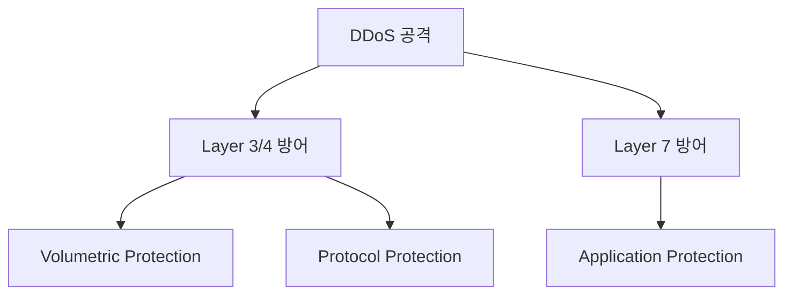
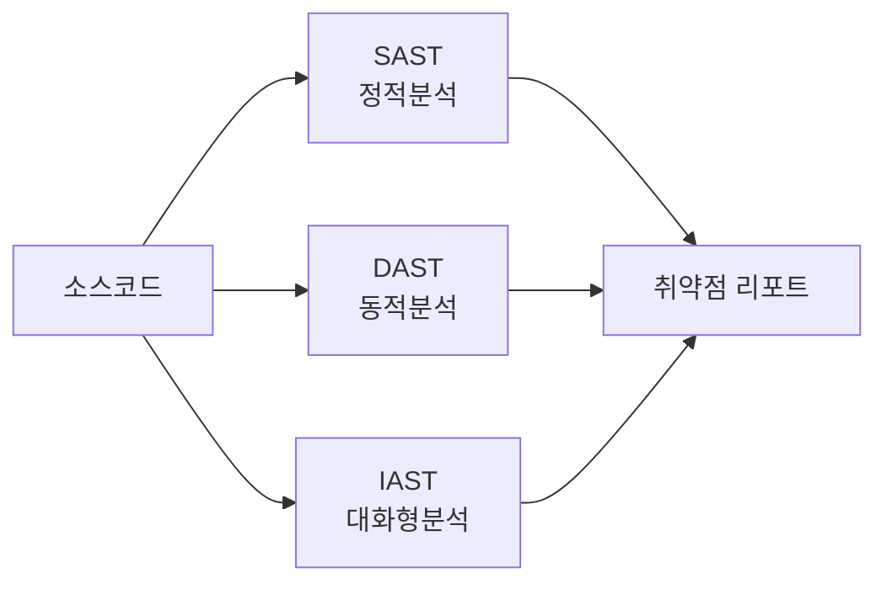
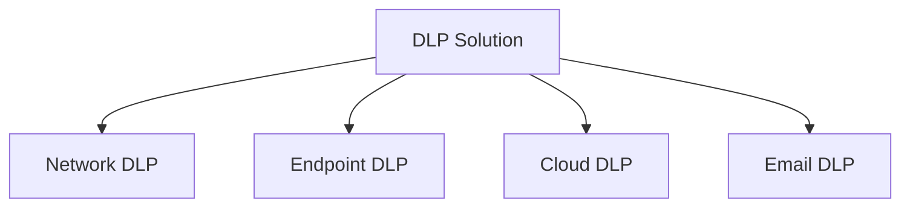
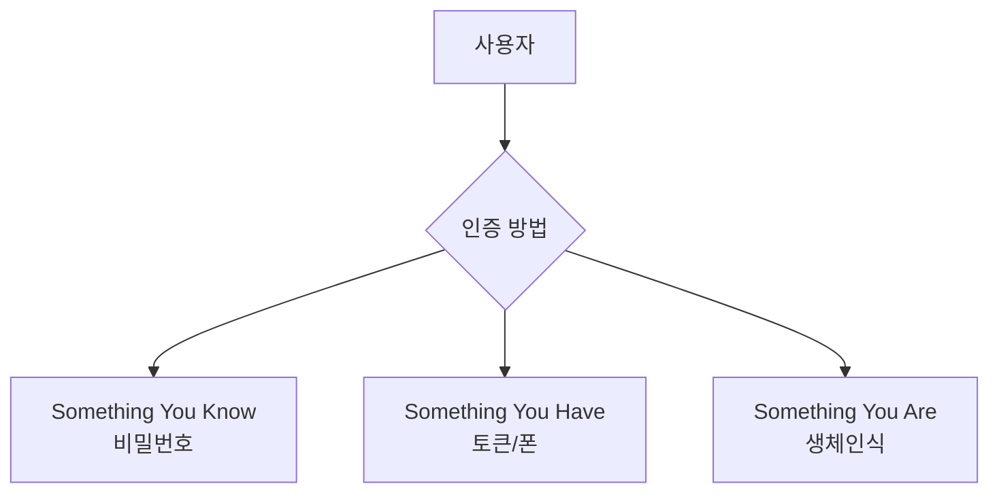
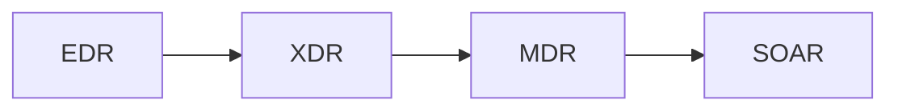
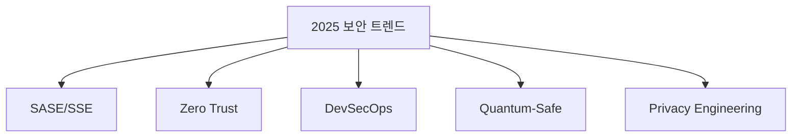

# 🛡️ 보안 기술 총정리

> 모든 웹/앱 보안 기술의 이름과 설명을 담은 완전 가이드


```
npm install -g mcp-security-copilot-2025
```


## 📑 목차
- [[#1. 네트워크/인프라 보안]]
- [[#2. 애플리케이션 보안]]
- [[#3. 데이터 보안]]
- [[#4. 인증/인가 기술]]
- [[#5. 클라우드 보안]]
- [[#6. 모니터링/분석 도구]]
- [[#7. 보안 프레임워크/표준]]
- [[#8. 신기술 보안]]

---

## 1. 네트워크/인프라 보안

### 🔥 방화벽 (Firewall) 계열

| 기술명 | 풀네임 | 설명 | 대표 제품 |
|--------|--------|------|----------|
| **WAF** | Web Application Firewall | 웹 애플리케이션 전용 방화벽 | Cloudflare, AWS WAF |
| **NGFW** | Next-Generation Firewall | 차세대 통합 방화벽 | Palo Alto, Fortinet |
| **UTM** | Unified Threat Management | 통합 위협 관리 | SonicWall, WatchGuard |
| **SWG** | Secure Web Gateway | 웹 트래픽 필터링 | Zscaler, Symantec |
| **Cloud Firewall** | - | 클라우드 네이티브 방화벽 | Azure Firewall |

### 🚨 침입 탐지/방지 시스템

| 기술명 | 풀네임 | 기능 | 대표 제품 |
|--------|--------|------|-----------|
| **IDS** | Intrusion Detection System | 침입 탐지 | Snort, Suricata |
| **IPS** | Intrusion Prevention System | 침입 차단 | TippingPoint |
| **NIDS** | Network IDS | 네트워크 트래픽 분석 | Zeek (Bro) |
| **HIDS** | Host IDS | 호스트 레벨 탐지 | OSSEC, Tripwire |

### 🌊 DDoS 방어 기술



- **Cloudflare DDoS Protection**
- **AWS Shield** (Standard/Advanced)
- **Akamai Prolexic**
- **BGP Flowspec**
- **Anycast Network**

### 🔒 VPN/원격 접속

- **IPSec VPN** - Site-to-Site 연결
- **SSL VPN** - 원격 사용자 접속
- **SASE** (Secure Access Service Edge)
- **ZTNA** (Zero Trust Network Access)
- **SD-WAN** (Software-Defined WAN)

---

## 2. 애플리케이션 보안

### 💻 코드 보안 테스팅



| 기술명 | 풀네임 | 설명 |
|--------|--------|------|
| **SAST** | Static Application Security Testing | 정적 코드 분석 |
| **DAST** | Dynamic Application Security Testing | 동적 테스팅 |
| **IAST** | Interactive Application Security Testing | 실행 중 분석 |
| **RASP** | Runtime Application Self-Protection | 런타임 보호 |
| **SCA** | Software Composition Analysis | 오픈소스 취약점 |

### 🔐 API 보안

- **API Gateway** - Kong, Apigee
- **Rate Limiting** - 요청 속도 제한
- **OAuth 2.0** - 인가 프레임워크
- **API Key Management** - 키 관리
- **GraphQL Security** - GraphQL 보안
- **Webhook Security** - 웹훅 검증

### 🌐 웹 보안 기술

| 취약점 | 방어 기술 | 구현 방법 |
|--------|----------|----------|
| **XSS** | Input Validation, CSP | 입력 검증, 출력 인코딩 |
| **CSRF** | CSRF Token | 토큰 검증 |
| **SQL Injection** | Prepared Statements | 파라미터화 쿼리 |
| **XXE** | XML Parser 설정 | DTD 비활성화 |

---

## 3. 데이터 보안

### 🔑 암호화 기술

#### 대칭키 암호화
- **AES** (128/192/256)
- **3DES** (Triple DES)
- **ChaCha20-Poly1305**

#### 비대칭키 암호화
- **RSA** (2048/4096)
- **ECC** (Elliptic Curve)
- **DSA** (Digital Signature)

#### 해시 함수
- **SHA** (256/384/512)
- **bcrypt** - 비밀번호 해싱
- **Argon2** - 최신 비밀번호 해싱
- **scrypt** - 메모리 하드 해싱

### 💾 데이터 손실 방지 (DLP)



- **Network DLP** - Symantec, Forcepoint
- **Endpoint DLP** - Microsoft Purview
- **Cloud DLP** - Google Cloud DLP
- **CASB** - Cloud Access Security Broker

### 🗄️ 데이터베이스 보안

- **TDE** (Transparent Data Encryption)
- **Column Encryption** - 컬럼 암호화
- **Data Masking** - 데이터 마스킹
- **Database Firewall** - DB 방화벽
- **DAM** (Database Activity Monitoring)

---

## 4. 인증/인가 기술

### 🔐 인증 (Authentication)



| 기술 | 설명 | 보안 수준 |
|------|------|----------|
| **MFA/2FA** | Multi-Factor Authentication | ⭐⭐⭐⭐⭐ |
| **SSO** | Single Sign-On | ⭐⭐⭐⭐ |
| **SAML** | Security Assertion Markup Language | ⭐⭐⭐⭐ |
| **OAuth 2.0** | Open Authorization | ⭐⭐⭐ |
| **FIDO2** | Fast Identity Online | ⭐⭐⭐⭐⭐ |

### 🎫 인가 (Authorization)

- **RBAC** (Role-Based Access Control)
- **ABAC** (Attribute-Based Access Control)
- **PBAC** (Policy-Based Access Control)
- **ACL** (Access Control List)
- **JWT** (JSON Web Token)

---

## 5. 클라우드 보안

### ☁️ 클라우드 네이티브 보안

| 기술명 | 풀네임 | 설명 |
|--------|--------|------|
| **CSPM** | Cloud Security Posture Management | 클라우드 보안 상태 관리 |
| **CWPP** | Cloud Workload Protection Platform | 워크로드 보호 |
| **CNAPP** | Cloud-Native Application Protection | 통합 앱 보호 |
| **CIEM** | Cloud Infrastructure Entitlement Management | 권한 관리 |

### 🐳 컨테이너/쿠버네티스 보안

- **Container Scanning** - Twistlock, Aqua
- **Kubernetes Security** - Falco, OPA
- **Service Mesh** - Istio, Linkerd
- **Image Registry Security**
- **Runtime Protection**

---

## 6. 모니터링/분석 도구

### 📊 SIEM (Security Information and Event Management)

| 제품 | 제조사 | 특징 |
|------|--------|------|
| **Splunk** | Splunk | 강력한 검색 |
| **QRadar** | IBM | AI 기반 |
| **Elastic Security** | Elastic | 오픈소스 |
| **Azure Sentinel** | Microsoft | 클라우드 네이티브 |

### 🔍 위협 탐지/대응



- **EDR** (Endpoint Detection and Response)
- **XDR** (Extended Detection and Response)
- **MDR** (Managed Detection and Response)
- **NDR** (Network Detection and Response)
- **SOAR** (Security Orchestration, Automation and Response)

### 📈 분석 기술

- **UEBA** (User and Entity Behavior Analytics)
- **NTA** (Network Traffic Analysis)
- **Threat Intelligence Platform**
- **IOC** (Indicators of Compromise)

---

## 7. 보안 프레임워크/표준

### 📜 국제 표준

| 표준 | 설명 | 대상 |
|------|------|------|
| **ISO 27001** | 정보보안 관리체계 | 모든 조직 |
| **SOC 2** | 서비스 조직 통제 | SaaS |
| **PCI DSS** | 카드 산업 보안 | 카드 취급 |
| **GDPR** | 개인정보보호 | EU 비즈니스 |

### 🎯 보안 프레임워크

- **NIST Cybersecurity Framework**
- **OWASP** (Top 10, ASVS, SAMM)
- **CIS Controls**
- **MITRE ATT&CK**
- **Zero Trust Architecture**

### 🏛️ 국내 인증

- **ISMS-P** - 정보보호 관리체계
- **PIMS** - 개인정보보호 관리체계
- **클라우드 보안인증** (CSAP)

---

## 8. 신기술 보안

### 🤖 AI/ML 보안

- **AI-powered Threat Detection**
- **Behavioral Analytics**
- **Automated Incident Response**
- **Predictive Security**
- **Deep Learning Malware Detection**

### 🔗 블록체인 보안

- **DID** (Decentralized Identity)
- **Smart Contract Auditing**
- **Distributed PKI**
- **Blockchain SIEM**

### 🌐 IoT/OT 보안

- **IoT Device Authentication**
- **Firmware Security**
- **OT/ICS Security** (SCADA, PLC)
- **Network Segmentation**

### 🚀 최신 트렌드



---

## 📚 보안 용어 약어 사전

### A-Z 주요 약어

| 약어 | 풀네임 | 한글 설명 |
|------|--------|----------|
| **APT** | Advanced Persistent Threat | 지능형 지속 공격 |
| **CVE** | Common Vulnerabilities and Exposures | 공통 취약점 |
| **DDoS** | Distributed Denial of Service | 분산 서비스 거부 |
| **EPP** | Endpoint Protection Platform | 엔드포인트 보호 |
| **FIM** | File Integrity Monitoring | 파일 무결성 모니터링 |
| **HSM** | Hardware Security Module | 하드웨어 보안 모듈 |
| **NAC** | Network Access Control | 네트워크 접근 제어 |
| **PAM** | Privileged Access Management | 특권 계정 관리 |
| **PKI** | Public Key Infrastructure | 공개키 기반구조 |
| **SOC** | Security Operations Center | 보안 운영 센터 |
| **TPM** | Trusted Platform Module | 신뢰 플랫폼 모듈 |
| **VPC** | Virtual Private Cloud | 가상 사설 클라우드 |
| **ZTA** | Zero Trust Architecture | 제로 트러스트 |

---

## 🏷️ 태그

#보안기술 #웹보안 #앱보안 #네트워크보안 #클라우드보안 #보안용어

---

> 📌 **참고**: [[📚 웹앱보안 INDEX]]로 돌아가기

> 💡 **다음 문서**: [[✅ 보안 체크리스트]] | [[🚨 필수 보안 구현]]